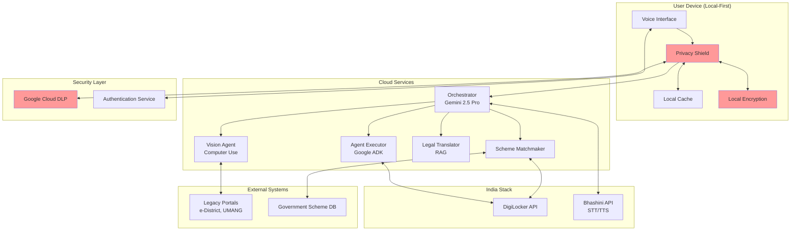
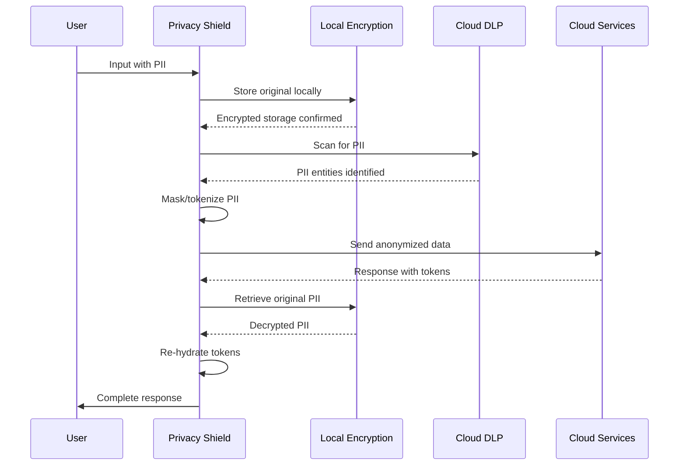
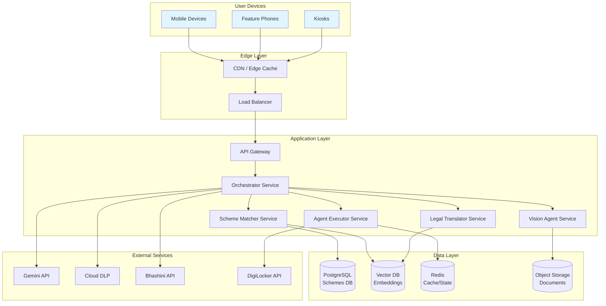

# Design Document: Jan Sewa AI

## Overview

Jan Sewa AI is a Voice-First Multimodal AI Agentic Ecosystem that democratizes access to government services in India. The system employs a modular multi-agent architecture orchestrated by Google Agent Development Kit (ADK) and powered by Gemini 2.5 Pro. The design prioritizes privacy-first processing, multilingual voice interaction, and autonomous task execution across legacy government portals.

The architecture follows a local-first approach where sensitive PII is processed on-device, with only anonymized data sent to cloud services. The system integrates deeply with India Stack (DigiLocker, Bhashini) and uses advanced AI capabilities (RAG, Computer Vision, Multi-Agent Orchestration) to provide an inclusive, accessible interface for citizens with limited digital literacy.

## Architecture

### High-Level Architecture



### Multi-Agent Architecture

The system employs a hierarchical multi-agent architecture where the Orchestrator coordinates specialized agents:

1. **Orchestrator (Gemini 2.5 Pro)**: Central coordinator that interprets user intent, plans workflows, and delegates to specialized agents
2. **Agent Executor**: Executes discrete workflow steps using Google ADK's agent framework
3. **Scheme Matchmaker**: Analyzes user profiles and proactively discovers eligible welfare schemes
4. **Legal Translator**: Simplifies complex legal language using RAG
5. **Vision Agent**: Interacts with legacy portals using Gemini Computer Use model
6. **Bhashini Adapter**: Handles multilingual speech-to-text and text-to-speech

Each agent operates independently with well-defined interfaces, enabling parallel execution and modular evolution.

## Components and Interfaces

### 1. Voice Interface Layer

**Responsibility**: Capture user voice input and deliver voice responses

**Technology Stack**:
- Wake word detection: Porcupine or Snowboy (on-device)
- Audio capture: WebRTC or native device APIs
- Audio playback: Native device audio APIs

**Interfaces**:
```typescript
interface VoiceInterface {
  // Start listening for voice input
  startListening(): Promise<void>
  
  // Stop listening
  stopListening(): void
  
  // Process captured audio and return transcription
  processAudio(audioBuffer: ArrayBuffer): Promise<AudioInput>
  
  // Play voice response
  playResponse(audioBuffer: ArrayBuffer): Promise<void>
  
  // Get current listening state
  getState(): ListeningState
}

interface AudioInput {
  transcription: string
  language: string
  confidence: number
  timestamp: Date
}

enum ListeningState {
  IDLE,
  LISTENING,
  PROCESSING,
  SPEAKING
}
```

### 2. Privacy Shield

**Responsibility**: Protect user PII through local processing, masking, and encryption

**Technology Stack**:
- Google Cloud DLP API for PII detection
- AES-256 for local encryption
- Format-preserving tokenization for masking
- Device keystore for key management

**Data Flow**:



**Interfaces**:
```typescript
interface PrivacyShield {
  // Scan text for PII and return detected entities
  detectPII(text: string): Promise<PIIEntity[]>
  
  // Mask PII in text before cloud transmission
  maskPII(text: string, entities: PIIEntity[]): Promise<MaskedData>
  
  // Re-hydrate masked tokens with original PII
  rehydrate(maskedData: MaskedData): Promise<string>
  
  // Store PII locally with encryption
  storeLocal(key: string, data: any): Promise<void>
  
  // Retrieve and decrypt local PII
  retrieveLocal(key: string): Promise<any>
  
  // Delete all user PII
  deleteAllPII(userId: string): Promise<void>
  
  // Get audit log of PII access
  getAuditLog(userId: string): Promise<AuditEntry[]>
}

interface PIIEntity {
  type: PIIType
  value: string
  startIndex: number
  endIndex: number
  confidence: number
}

enum PIIType {
  AADHAAR,
  PAN,
  PHONE,
  EMAIL,
  ADDRESS,
  BANK_ACCOUNT,
  NAME
}

interface MaskedData {
  maskedText: string
  tokens: Map<string, string>  // token -> original value
  metadata: MaskingMetadata
}
```

### 3. Orchestrator

**Responsibility**: Coordinate all agents, manage conversation state, and plan workflows

**Technology Stack**:
- Gemini 2.5 Pro API
- Google ADK for agent coordination
- State management: Redis or in-memory store

**Interfaces**:
```typescript
interface Orchestrator {
  // Process user input and determine intent
  processInput(input: UserInput): Promise<Intent>
  
  // Create workflow plan for intent
  planWorkflow(intent: Intent): Promise<Workflow>
  
  // Execute workflow by coordinating agents
  executeWorkflow(workflow: Workflow): Promise<WorkflowResult>
  
  // Get current conversation state
  getConversationState(sessionId: string): Promise<ConversationState>
  
  // Update conversation state
  updateState(sessionId: string, update: StateUpdate): Promise<void>
}

interface UserInput {
  text: string
  language: string
  sessionId: string
  timestamp: Date
  context: Map<string, any>
}

interface Intent {
  type: IntentType
  entities: Map<string, any>
  confidence: number
  requiredAgents: AgentType[]
}

enum IntentType {
  DOCUMENT_RETRIEVAL,
  FORM_SUBMISSION,
  SCHEME_DISCOVERY,
  LEGAL_EXPLANATION,
  GENERAL_QUERY
}

interface Workflow {
  id: string
  steps: WorkflowStep[]
  requiredDocuments: string[]
  estimatedDuration: number
}

interface WorkflowStep {
  id: string
  agent: AgentType
  action: string
  inputs: Map<string, any>
  dependencies: string[]  // IDs of prerequisite steps
}
```

### 4. Agent Executor

**Responsibility**: Execute discrete workflow steps using Google ADK agents

**Technology Stack**:
- Google Agent Development Kit (ADK)
- Gemini 2.5 Pro for agent reasoning
- Custom tools for API interactions

**Interfaces**:
```typescript
interface AgentExecutor {
  // Execute a single workflow step
  executeStep(step: WorkflowStep, context: ExecutionContext): Promise<StepResult>
  
  // Register a new agent capability
  registerAgent(agent: Agent): void
  
  // Get available agents
  getAgents(): Agent[]
  
  // Execute multiple steps in parallel
  executeParallel(steps: WorkflowStep[], context: ExecutionContext): Promise<StepResult[]>
}

interface Agent {
  id: string
  name: string
  capabilities: string[]
  tools: Tool[]
  execute(action: string, inputs: Map<string, any>): Promise<any>
}

interface Tool {
  name: string
  description: string
  parameters: ToolParameter[]
  execute(params: Map<string, any>): Promise<any>
}

interface ExecutionContext {
  sessionId: string
  userId: string
  userProfile: UserProfile
  documents: Document[]
  previousResults: Map<string, any>
}

interface StepResult {
  success: boolean
  output: any
  error?: Error
  duration: number
  metadata: Map<string, any>
}
```

### 5. Scheme Matchmaker

**Responsibility**: Analyze user profiles and discover eligible welfare schemes

**Technology Stack**:
- Gemini 2.5 Pro for eligibility analysis
- Vector database (Pinecone/Weaviate) for scheme embeddings
- PostgreSQL for scheme database

**Scheme Database Schema**:
```typescript
interface Scheme {
  id: string
  name: string
  nameTranslations: Map<string, string>  // language -> translated name
  description: string
  descriptionTranslations: Map<string, string>
  eligibilityCriteria: EligibilityCriteria
  benefits: Benefit[]
  requiredDocuments: string[]
  applicationProcess: ApplicationStep[]
  deadlines: Deadline[]
  governmentLevel: GovernmentLevel  // Central, State, District
  state?: string  // For state-specific schemes
  category: SchemeCategory
  officialUrl: string
  active: boolean
  version: number
  lastUpdated: Date
}

interface EligibilityCriteria {
  age?: AgeRange
  income?: IncomeRange
  gender?: Gender[]
  caste?: Caste[]
  location?: Location[]
  occupation?: Occupation[]
  disability?: DisabilityType[]
  customCriteria: Map<string, any>
}

interface Benefit {
  type: BenefitType
  amount?: number
  description: string
  frequency?: BenefitFrequency
}

enum SchemeCategory {
  AGRICULTURE,
  EDUCATION,
  HEALTHCARE,
  PENSION,
  HOUSING,
  EMPLOYMENT,
  WOMEN_WELFARE,
  CHILD_WELFARE
}
```

**Interfaces**:
```typescript
interface SchemeMatcher {
  // Find schemes matching user profile
  findEligibleSchemes(profile: UserProfile): Promise<SchemeMatch[]>
  
  // Calculate eligibility confidence score
  calculateEligibility(scheme: Scheme, profile: UserProfile): Promise<number>
  
  // Get required documents for scheme application
  getRequiredDocuments(schemeId: string): Promise<string[]>
  
  // Check if user has required documents in DigiLocker
  checkDocumentAvailability(schemeId: string, userId: string): Promise<DocumentAvailability>
}

interface SchemeMatch {
  scheme: Scheme
  confidenceScore: number
  matchedCriteria: string[]
  missingCriteria: string[]
  availableDocuments: string[]
  missingDocuments: string[]
  estimatedBenefit: number
}

interface UserProfile {
  userId: string
  age: number
  gender: Gender
  income: number
  caste?: Caste
  location: Location
  occupation?: Occupation
  disability?: DisabilityType
  familySize: number
  landOwnership?: number
  educationLevel?: EducationLevel
  documents: string[]  // Available in DigiLocker
}
```

### 6. Legal Translator

**Responsibility**: Simplify complex legal language using RAG

**Technology Stack**:
- Gemini 2.5 Pro for text generation
- Vector database (Pinecone/Weaviate) for legal knowledge base
- Embedding model: text-embedding-004

**Knowledge Base Structure**:
```typescript
interface LegalKnowledgeEntry {
  id: string
  legalTerm: string
  simplifiedExplanation: string
  simplifiedTranslations: Map<string, string>  // language -> translation
  examples: string[]
  relatedTerms: string[]
  category: LegalCategory
  embedding: number[]
  fleschKincaidScore: number
  verified: boolean
  lastReviewed: Date
}

enum LegalCategory {
  CONTRACTS,
  RIGHTS,
  OBLIGATIONS,
  PROCEDURES,
  PENALTIES,
  DEFINITIONS
}
```

**Interfaces**:
```typescript
interface LegalTranslator {
  // Simplify legal text to 5th-grade level
  simplify(legalText: string, targetLanguage: string): Promise<SimplifiedText>
  
  // Identify complex legal terms in text
  identifyLegalTerms(text: string): Promise<LegalTerm[]>
  
  // Get explanation for specific legal term
  explainTerm(term: string, language: string): Promise<string>
  
  // Validate simplified text preserves legal meaning
  validateSimplification(original: string, simplified: string): Promise<ValidationResult>
}

interface SimplifiedText {
  originalText: string
  simplifiedText: string
  fleschKincaidScore: number
  highlightedTerms: LegalTerm[]
  preservesMeaning: boolean
  confidence: number
}

interface LegalTerm {
  term: string
  startIndex: number
  endIndex: number
  explanation: string
  category: LegalCategory
}
```

### 7. Vision Agent

**Responsibility**: Interact with legacy government portals using computer vision

**Technology Stack**:
- Gemini 2.5 Pro with Computer Use capability
- Selenium/Playwright for browser automation
- Screenshot capture and analysis

**Interfaces**:
```typescript
interface VisionAgent {
  // Navigate to portal and complete workflow
  executePortalWorkflow(portal: PortalConfig, workflow: PortalWorkflow): Promise<PortalResult>
  
  // Capture and analyze portal screenshot
  analyzeScreen(screenshot: Buffer): Promise<ScreenAnalysis>
  
  // Identify interactive elements on page
  identifyElements(screenshot: Buffer): Promise<UIElement[]>
  
  // Fill form fields
  fillForm(fields: Map<string, string>): Promise<void>
  
  // Click button or link
  clickElement(element: UIElement): Promise<void>
  
  // Handle CAPTCHA with user assistance
  solveCaptcha(): Promise<string>
}

interface PortalConfig {
  name: string
  baseUrl: string
  authMethod: AuthMethod
  rateLimit: RateLimit
  sessionTimeout: number
  knownSelectors: Map<string, string>  // Cached selectors for common elements
}

interface PortalWorkflow {
  steps: PortalStep[]
  requiredData: Map<string, any>
  expectedOutcome: string
}

interface PortalStep {
  action: PortalAction
  target?: string  // Element selector or description
  input?: any
  verification: string  // How to verify step succeeded
}

enum PortalAction {
  NAVIGATE,
  FILL_FIELD,
  CLICK_BUTTON,
  SELECT_DROPDOWN,
  UPLOAD_FILE,
  WAIT,
  VERIFY
}

interface ScreenAnalysis {
  elements: UIElement[]
  currentPage: string
  errors: string[]
  suggestions: string[]
}

interface UIElement {
  type: ElementType
  label: string
  selector: string
  bounds: Rectangle
  interactable: boolean
}

enum ElementType {
  BUTTON,
  TEXT_INPUT,
  DROPDOWN,
  CHECKBOX,
  RADIO,
  LINK,
  FILE_UPLOAD
}
```

### 8. Bhashini Adapter

**Responsibility**: Handle multilingual speech-to-text and text-to-speech

**Technology Stack**:
- Bhashini API (ULCA platform)
- Language detection: fastText or Bhashini's detection API
- Local fallback models: Whisper (STT), Coqui TTS (TTS)

**Interfaces**:
```typescript
interface BhashiniAdapter {
  // Convert speech to text
  speechToText(audio: ArrayBuffer, language?: string): Promise<STTResult>
  
  // Convert text to speech
  textToSpeech(text: string, language: string, voice?: VoiceConfig): Promise<ArrayBuffer>
  
  // Detect language from audio
  detectLanguage(audio: ArrayBuffer): Promise<LanguageDetection>
  
  // Handle code-mixing (Hinglish, etc.)
  processCodeMixing(audio: ArrayBuffer): Promise<STTResult>
  
  // Check if Bhashini API is available
  checkAvailability(): Promise<boolean>
  
  // Fallback to local models
  useFallback(enable: boolean): void
}

interface STTResult {
  text: string
  language: string
  confidence: number
  alternatives: Alternative[]
  duration: number
}

interface Alternative {
  text: string
  confidence: number
}

interface LanguageDetection {
  language: string
  confidence: number
  alternatives: LanguageAlternative[]
}

interface LanguageAlternative {
  language: string
  confidence: number
}

interface VoiceConfig {
  gender: Gender
  speed: number  // 0.5 to 2.0
  pitch: number  // 0.5 to 2.0
}
```

### 9. DigiLocker Connector

**Responsibility**: Retrieve user documents from DigiLocker

**Technology Stack**:
- DigiLocker API v2.0
- OAuth 2.0 for authentication
- Document caching with encryption

**Interfaces**:
```typescript
interface DigiLockerConnector {
  // Initiate OAuth authentication
  authenticate(): Promise<AuthResult>
  
  // Refresh access token
  refreshToken(): Promise<void>
  
  // Get list of available documents
  listDocuments(userId: string): Promise<DocumentMetadata[]>
  
  // Retrieve specific document
  getDocument(documentId: string): Promise<Document>
  
  // Check if specific document type is available
  hasDocument(userId: string, documentType: DocumentType): Promise<boolean>
  
  // Revoke access
  revokeAccess(userId: string): Promise<void>
}

interface AuthResult {
  accessToken: string
  refreshToken: string
  expiresIn: number
  userId: string
}

interface DocumentMetadata {
  id: string
  type: DocumentType
  name: string
  issuer: string
  issueDate: Date
  expiryDate?: Date
  size: number
}

interface Document {
  metadata: DocumentMetadata
  content: Buffer
  format: DocumentFormat
  verified: boolean
}

enum DocumentType {
  AADHAAR,
  PAN,
  DRIVING_LICENSE,
  VOTER_ID,
  INCOME_CERTIFICATE,
  CASTE_CERTIFICATE,
  DOMICILE_CERTIFICATE,
  EDUCATION_CERTIFICATE,
  BIRTH_CERTIFICATE
}

enum DocumentFormat {
  PDF,
  XML,
  JSON,
  IMAGE
}
```

## Data Models

### Core Data Models

```typescript
// User and Session Management
interface User {
  id: string
  phoneNumber: string
  aadhaarHash?: string  // Hashed, never stored in plain text
  preferredLanguage: string
  voiceBiometric?: Buffer  // Encrypted voice signature
  profile: UserProfile
  preferences: UserPreferences
  createdAt: Date
  lastActive: Date
}

interface UserPreferences {
  speechRate: number
  volume: number
  voiceGender: Gender
  assistedMode: boolean
  textFallback: boolean
  notificationPreferences: NotificationPreferences
}

interface Session {
  id: string
  userId: string
  startTime: Date
  lastActivity: Date
  state: ConversationState
  activeWorkflow?: Workflow
  expiresAt: Date
}

interface ConversationState {
  messages: Message[]
  context: Map<string, any>
  currentIntent?: Intent
  pendingActions: string[]
}

interface Message {
  id: string
  role: MessageRole
  content: string
  language: string
  timestamp: Date
  metadata: Map<string, any>
}

enum MessageRole {
  USER,
  ASSISTANT,
  SYSTEM
}

// Workflow Management
interface WorkflowExecution {
  id: string
  workflowId: string
  userId: string
  status: WorkflowStatus
  currentStep: number
  steps: StepExecution[]
  startTime: Date
  endTime?: Date
  result?: WorkflowResult
  errors: Error[]
}

interface StepExecution {
  stepId: string
  status: StepStatus
  startTime: Date
  endTime?: Date
  result?: StepResult
  retryCount: number
  logs: string[]
}

enum WorkflowStatus {
  PENDING,
  IN_PROGRESS,
  WAITING_USER_INPUT,
  COMPLETED,
  FAILED,
  CANCELLED
}

enum StepStatus {
  PENDING,
  IN_PROGRESS,
  COMPLETED,
  FAILED,
  SKIPPED
}

interface WorkflowResult {
  success: boolean
  output: any
  documents: Document[]
  summary: string
  duration: number
}

// Audit and Logging
interface AuditEntry {
  id: string
  userId: string
  action: AuditAction
  resource: string
  timestamp: Date
  ipAddress?: string
  deviceId?: string
  success: boolean
  details: Map<string, any>
}

enum AuditAction {
  LOGIN,
  LOGOUT,
  DOCUMENT_ACCESS,
  PII_MASKED,
  PII_REHYDRATED,
  WORKFLOW_STARTED,
  WORKFLOW_COMPLETED,
  SCHEME_DISCOVERED,
  PORTAL_INTERACTION
}

// Location and Demographics
interface Location {
  state: string
  district: string
  block?: string
  village?: string
  pincode: string
  urban: boolean
}

enum Gender {
  MALE,
  FEMALE,
  OTHER
}

enum Caste {
  GENERAL,
  OBC,
  SC,
  ST
}

enum Occupation {
  FARMER,
  LABORER,
  SELF_EMPLOYED,
  SALARIED,
  UNEMPLOYED,
  STUDENT,
  RETIRED
}

enum DisabilityType {
  VISUAL,
  HEARING,
  MOTOR,
  COGNITIVE,
  MULTIPLE
}

enum EducationLevel {
  ILLITERATE,
  PRIMARY,
  SECONDARY,
  HIGHER_SECONDARY,
  GRADUATE,
  POST_GRADUATE
}
```

## Correctness Properties

*A property is a characteristic or behavior that should hold true across all valid executions of a system—essentially, a formal statement about what the system should do. Properties serve as the bridge between human-readable specifications and machine-verifiable correctness guarantees.*


### Property Reflection

After analyzing all acceptance criteria, I've identified several areas of redundancy:

1. **PII Protection Properties**: Requirements 5.3, 5.9, and 5.10 all test PII masking - can be consolidated into comprehensive PII protection properties
2. **Retry Behavior**: Requirements 1.5 and 6.6 both test retry logic - can be unified
3. **Caching Properties**: Requirements 10.5 and 13.8 both address caching - redundant
4. **Logging Properties**: Requirements 6.10, 14.1, and 14.2 all test logging - can be consolidated
5. **Authentication Properties**: Requirements 7.2 and 12.7 both test secure storage - redundant
6. **Fallback Behavior**: Requirements 3.7 and 7.8 test similar fallback patterns - can be unified

The following properties eliminate redundancy while maintaining comprehensive coverage.

### Correctness Properties

#### Workflow Execution Properties

**Property 1: Workflow Decomposition Completeness**
*For any* user service request, the Orchestrator should produce a workflow with at least one step, where each step has a defined agent, action, and inputs.
**Validates: Requirements 1.1**

**Property 2: Autonomous Workflow Execution**
*For any* workflow without explicit user input steps, the Agent_Executor should execute all steps to completion without pausing for user intervention.
**Validates: Requirements 1.2**

**Property 3: Sequential Step Progression**
*For any* workflow with multiple steps, when step N completes successfully, step N+1 should be initiated immediately.
**Validates: Requirements 1.4**

**Property 4: Retry with Exponential Backoff**
*For any* failed workflow step, the system should retry exactly 3 times with exponentially increasing delays (e.g., 1s, 2s, 4s) before escalating.
**Validates: Requirements 1.5, 6.6**

**Property 5: User Input Pause Points**
*For any* workflow containing steps marked as requiring user input, execution should pause at those steps and request the specific information.
**Validates: Requirements 1.6**

**Property 6: Workflow Completion Summary**
*For any* completed workflow, the output should contain a summary with the workflow outcome, status, and list of any retrieved documents.
**Validates: Requirements 1.7**

#### Scheme Discovery Properties

**Property 7: Profile Change Triggers Analysis**
*For any* user profile creation or update event, the Scheme_Matchmaker analysis function should be invoked with the updated profile data.
**Validates: Requirements 2.1**

**Property 8: Document Retrieval During Analysis**
*For any* scheme eligibility analysis that requires supporting documents, the DigiLocker retrieval function should be called for those document types.
**Validates: Requirements 2.2**

**Property 9: Confidence Score Bounds**
*For any* scheme match result, the confidence score should be a number in the range [0, 100].
**Validates: Requirements 2.3**

**Property 10: Scheme Ranking by Relevance**
*For any* list of eligible schemes, the schemes should be sorted in descending order by their relevance score.
**Validates: Requirements 2.4**

**Property 11: Scheme Presentation Completeness**
*For any* scheme presented to a user, the output should contain all of: eligibility criteria, benefits, required documents, and application steps.
**Validates: Requirements 2.6**

#### Multilingual Voice Properties

**Property 12: Language Detection on Input**
*For any* voice input, the Bhashini_Adapter should return a detected language code from the supported language set.
**Validates: Requirements 3.1**

**Property 13: Response Language Consistency**
*For any* text-to-speech request, the output audio language should match the user's detected or preferred language.
**Validates: Requirements 3.3**

**Property 14: Language Switch Detection**
*For any* voice input in a different language than the previous input, the system should detect the language change and update the conversation language.
**Validates: Requirements 3.4**

**Property 15: Low Confidence Clarification**
*For any* speech recognition result with confidence below 70%, the system should generate a clarification request to the user.
**Validates: Requirements 3.6**

**Property 16: API Fallback Behavior**
*For any* Bhashini API failure, the system should automatically switch to local language models for the 5 most common languages.
**Validates: Requirements 3.7, 7.8**

**Property 17: Context Preservation Across Language Switches**
*For any* language switch during a conversation, the conversation context (workflow state, user intent, previous messages) should remain unchanged.
**Validates: Requirements 3.8**

#### Legal Simplification Properties

**Property 18: Legal Term Identification**
*For any* legal text input, the Legal_Translator should identify and return a list of complex legal terms present in the text.
**Validates: Requirements 4.1**

**Property 19: Reading Level Compliance**
*For any* simplified legal text output, the Flesch-Kincaid grade level score should be 5.0 or lower.
**Validates: Requirements 4.3**

**Property 20: Dual Version Presentation**
*For any* legal text simplification, the output should contain both the original legal text and the simplified version.
**Validates: Requirements 4.5**

**Property 21: Critical Term Highlighting**
*For any* legal text containing terms marked as critical (obligations, rights, penalties), those terms should be flagged or emphasized in the output.
**Validates: Requirements 4.7**

**Property 22: Unknown Term Fallback**
*For any* legal term not found in the knowledge base, the system should invoke Gemini for explanation and mark the result as requiring human review.
**Validates: Requirements 4.8**

#### Privacy and Security Properties

**Property 23: Local-First PII Storage**
*For any* user data collection event, PII should be written to local storage before any network transmission occurs.
**Validates: Requirements 5.1**

**Property 24: Outbound PII Scanning**
*For any* data transmission to cloud services, the Privacy_Shield DLP scan function should be invoked on the data payload.
**Validates: Requirements 5.2**

**Property 25: Comprehensive PII Masking**
*For any* outbound data containing detected PII (Aadhaar, phone, address, bank account), the transmitted version should have all PII entities masked or tokenized.
**Validates: Requirements 5.3, 5.9, 5.10**

**Property 26: Local-Only Re-hydration**
*For any* inbound data containing masked tokens, the re-hydration with original PII should occur only on the local device, never via cloud API calls.
**Validates: Requirements 5.5**

**Property 27: PII Access Audit Trail**
*For any* PII access, masking, or transmission event, an audit log entry should be created with timestamp, action type, and resource identifier.
**Validates: Requirements 5.6**

**Property 28: Local PII Encryption**
*For any* PII stored locally, the data should be encrypted using AES-256 before writing to storage.
**Validates: Requirements 5.8**

#### Vision Agent Properties

**Property 29: Portal Screenshot Capture**
*For any* legacy portal workflow step, at least one screenshot should be captured before attempting interaction.
**Validates: Requirements 6.1**

**Property 30: Interactive Element Identification**
*For any* portal screenshot analysis, the output should contain a list of identified interactive elements with their types and locations.
**Validates: Requirements 6.2**

**Property 31: Form Field Matching**
*For any* form filling operation, each identified form field should be matched with a corresponding data field from the user profile or workflow context.
**Validates: Requirements 6.3**

**Property 32: Action Verification**
*For any* portal interaction (click, form submit), a verification step should be performed to confirm the action succeeded.
**Validates: Requirements 6.4**

**Property 33: CAPTCHA User Escalation**
*For any* detected CAPTCHA challenge, the system should pause workflow execution and request user assistance.
**Validates: Requirements 6.5**

**Property 34: Rate Limit Compliance**
*For any* sequence of portal interactions, the time interval between consecutive actions should respect the configured rate limit for that portal.
**Validates: Requirements 6.8**

**Property 35: Session Timeout Recovery**
*For any* detected portal session timeout, the system should initiate re-authentication before retrying the failed action.
**Validates: Requirements 6.9**

**Property 36: Portal Interaction Logging**
*For any* portal interaction, a log entry should be created containing the action type, timestamp, and screenshot reference.
**Validates: Requirements 6.10, 14.1**

#### DigiLocker Integration Properties

**Property 37: Secure Token Storage**
*For any* successful DigiLocker authentication, the access token should be stored using the Privacy_Shield secure storage mechanism.
**Validates: Requirements 7.2, 12.7**

**Property 38: Targeted Document Retrieval**
*For any* document retrieval request, only the specifically requested document types should be fetched from DigiLocker (no over-fetching).
**Validates: Requirements 7.4**

**Property 39: Token Refresh on Expiry**
*For any* DigiLocker API call that fails with token expiration error, the system should automatically attempt token refresh before retrying.
**Validates: Requirements 7.6**

#### Multi-Agent Orchestration Properties

**Property 40: Agent Selection**
*For any* user request, the Orchestrator should determine and return a non-empty set of required agents based on the intent.
**Validates: Requirements 8.2**

**Property 41: Inter-Agent Context Passing**
*For any* workflow with multiple agents, the output of agent N should be included in the execution context passed to agent N+1.
**Validates: Requirements 8.3**

**Property 42: Parallel Agent Execution**
*For any* workflow with steps that have no dependencies on each other, those steps should be executed concurrently rather than sequentially.
**Validates: Requirements 8.4**

**Property 43: Conversation State Persistence**
*For any* conversation turn, the conversation state (messages, context, intent) should be persisted and retrievable in subsequent turns.
**Validates: Requirements 8.5**

**Property 44: Agent Failure Fallback**
*For any* agent execution failure, the Orchestrator should attempt at least one fallback strategy before failing the entire workflow.
**Validates: Requirements 8.6**

**Property 45: Agent Performance Metrics**
*For any* agent execution, metrics (latency, success/failure, error type) should be recorded and emitted.
**Validates: Requirements 8.7**

#### Voice Interface Properties

**Property 46: Voice Input Acknowledgment**
*For any* voice input received, an audio feedback signal should be played within the acknowledgment window.
**Validates: Requirements 9.2**

**Property 47: Numbered Options Presentation**
*For any* response containing multiple options, each option should be prefixed with a sequential number starting from 1.
**Validates: Requirements 9.4**

**Property 48: Error Clarification**
*For any* user input that cannot be parsed or has ambiguous intent, the system should generate a clarifying question.
**Validates: Requirements 9.5**

**Property 49: Critical Information Repetition**
*For any* response containing critical information (OTP, confirmation number, deadline), that information should appear exactly twice in the output.
**Validates: Requirements 9.8**

#### Offline Capability Properties

**Property 50: Offline Cached Workflow Execution**
*For any* workflow that has been previously executed and cached, it should be executable when network connectivity is unavailable.
**Validates: Requirements 10.1**

**Property 51: Offline Local Model Usage**
*For any* operation performed while offline, local language models should be used instead of cloud API calls.
**Validates: Requirements 10.2**

**Property 52: Online Synchronization**
*For any* pending workflow actions queued while offline, they should be synchronized and executed when connectivity is restored.
**Validates: Requirements 10.3**

**Property 53: Cloud-Dependent Workflow Queueing**
*For any* workflow that requires cloud services when connectivity is unavailable, the workflow should be added to a pending queue.
**Validates: Requirements 10.4**

**Property 54: Frequent Data Caching**
*For any* data accessed more than N times (e.g., N=5), it should be cached locally for offline access.
**Validates: Requirements 10.5, 13.8**

**Property 55: Network Adaptation**
*For any* operation when network quality is poor (high latency or packet loss), the system should use compressed data formats and reduce payload sizes.
**Validates: Requirements 10.6**

**Property 56: Offline PII Protection**
*For any* operation performed in offline mode, PII encryption and access controls should remain active and enforced.
**Validates: Requirements 10.8**

#### Accessibility Properties

**Property 57: Text Alternative Availability**
*For any* voice interaction, a text-based alternative representation should be available for users with hearing impairments.
**Validates: Requirements 11.1**

**Property 58: Visual Content Voice Description**
*For any* visual content or UI element, a detailed voice description should be generated for users with visual impairments.
**Validates: Requirements 11.2**

**Property 59: Speech Parameter Customization**
*For any* user with custom speech preferences (rate, volume, pitch), the TTS output should match those preference values.
**Validates: Requirements 11.4**

**Property 60: Cognitive Accessibility Simplification**
*For any* user with cognitive disability flag enabled, all system responses should use simplified language with shorter sentences.
**Validates: Requirements 11.5**

**Property 61: No Forced Timeouts**
*For any* user interaction, the system should not impose time limits that force quick responses or automatic timeouts.
**Validates: Requirements 11.7**

#### Authentication and Security Properties

**Property 62: Sensitive Action Step-Up Authentication**
*For any* sensitive action (document access, form submission, profile change), step-up authentication should be required.
**Validates: Requirements 12.3**

**Property 63: Suspicious Activity Account Lock**
*For any* detected suspicious activity (unusual location, multiple failed attempts, impossible travel), the user account should be locked.
**Validates: Requirements 12.5**

**Property 64: TLS Encryption for Transit**
*For any* network data transmission, TLS 1.3 or higher should be used for encryption.
**Validates: Requirements 12.6**

**Property 65: Authentication Rate Limiting**
*For any* sequence of authentication attempts from the same user/IP, the system should enforce rate limiting (max 5 attempts per hour).
**Validates: Requirements 12.8**

#### Performance and Resilience Properties

**Property 66: API Timeout Enforcement**
*For any* external API call, a timeout should be configured and enforced to prevent indefinite waiting.
**Validates: Requirements 13.7**

#### Monitoring and Observability Properties

**Property 67: Comprehensive Error Context Capture**
*For any* error or exception, the log entry should contain stack trace, input data, system state, and correlation ID.
**Validates: Requirements 14.2**

**Property 68: Performance Metrics Emission**
*For any* operation, performance metrics (duration, resource usage, success/failure) should be emitted to the metrics system.
**Validates: Requirements 14.3**

**Property 69: Health Degradation Alerting**
*For any* system health metric that crosses a critical threshold, an alert should be triggered to administrators.
**Validates: Requirements 14.4**

**Property 70: Log PII Redaction**
*For any* log entry, all PII should be redacted before the log is persisted or transmitted.
**Validates: Requirements 14.6**

#### Scheme Database Properties

**Property 71: Scheme Definition Validation**
*For any* new or updated scheme definition, validation should be performed to ensure all required fields are present and valid.
**Validates: Requirements 15.4**

**Property 72: Expired Scheme Deactivation**
*For any* scheme with an expiry date in the past, the scheme should be marked as inactive and excluded from matching.
**Validates: Requirements 15.5**

## Error Handling

### Error Categories

The system handles errors across multiple categories:

1. **User Input Errors**: Unclear speech, unsupported language, invalid commands
2. **Authentication Errors**: Failed login, expired tokens, insufficient permissions
3. **Integration Errors**: API failures, network timeouts, service unavailability
4. **Data Errors**: Missing documents, invalid data formats, PII detection failures
5. **Workflow Errors**: Step failures, prerequisite violations, resource constraints
6. **System Errors**: Internal failures, resource exhaustion, configuration errors

### Error Handling Strategy

```typescript
interface ErrorHandler {
  // Classify error and determine handling strategy
  handleError(error: Error, context: ErrorContext): Promise<ErrorResolution>
  
  // Determine if error is retryable
  isRetryable(error: Error): boolean
  
  // Get user-friendly error message
  getUserMessage(error: Error, language: string): string
  
  // Log error with full context
  logError(error: Error, context: ErrorContext): void
  
  // Escalate to human support
  escalate(error: Error, context: ErrorContext): Promise<void>
}

interface ErrorContext {
  userId: string
  sessionId: string
  workflowId?: string
  stepId?: string
  agent?: string
  timestamp: Date
  systemState: Map<string, any>
}

interface ErrorResolution {
  strategy: ResolutionStrategy
  retryAfter?: number
  fallbackAction?: string
  userMessage: string
  requiresEscalation: boolean
}

enum ResolutionStrategy {
  RETRY,
  FALLBACK,
  SKIP_STEP,
  CANCEL_WORKFLOW,
  REQUEST_USER_INPUT,
  ESCALATE
}
```

### Error Handling Patterns

**Retry with Exponential Backoff**:
- Transient network errors
- API rate limiting
- Temporary service unavailability
- Max 3 retries with delays: 1s, 2s, 4s

**Fallback Strategies**:
- Bhashini API failure → Local language models
- DigiLocker API failure → Manual document upload
- Vision Agent failure → Direct API integration (if available)
- Cloud service failure → Offline mode with cached data

**User Escalation**:
- CAPTCHA challenges
- Ambiguous user intent
- Missing required information
- Workflow step failures after max retries

**Graceful Degradation**:
- Poor network → Compressed data, reduced features
- Offline mode → Cached workflows only
- Service unavailable → Queue for later execution

### Error Messages

All error messages follow these principles:
- **User-friendly**: No technical jargon or stack traces
- **Actionable**: Clear next steps for the user
- **Multilingual**: Translated to user's language
- **Contextual**: Specific to the current workflow
- **Supportive**: Non-judgmental, encouraging tone

Example error messages:
```
"I couldn't understand that. Could you please repeat?"
"The government portal is temporarily unavailable. I'll try again in a moment."
"I need your help to solve this security check. Can you tell me what you see?"
"Your session has expired for security. Let me verify your identity again."
```

## Testing Strategy

### Dual Testing Approach

The Jan Seva AI system requires comprehensive testing using both unit tests and property-based tests:

**Unit Tests**: Validate specific examples, edge cases, and error conditions
- Specific user scenarios (e.g., "retrieve driving license for user in Karnataka")
- Edge cases (empty input, malformed data, boundary values)
- Error conditions (API failures, timeouts, invalid tokens)
- Integration points between components
- Mock external dependencies (Bhashini, DigiLocker, portals)

**Property-Based Tests**: Verify universal properties across all inputs
- Generate random user profiles, workflows, and inputs
- Verify properties hold for all generated test cases
- Catch unexpected edge cases through randomization
- Validate invariants and system-wide guarantees
- Each property test runs minimum 100 iterations

### Property-Based Testing Configuration

**Testing Library**: Use `fast-check` for TypeScript/JavaScript or `Hypothesis` for Python

**Test Configuration**:
```typescript
// Example property test configuration
fc.assert(
  fc.property(
    // Generators for random inputs
    userProfileGenerator(),
    workflowGenerator(),
    
    // Property to verify
    (profile, workflow) => {
      const result = orchestrator.executeWorkflow(workflow, profile);
      // Property assertion
      return result.steps.length === workflow.steps.length;
    }
  ),
  { numRuns: 100 }  // Minimum 100 iterations
);
```

**Test Tagging**: Each property test must reference its design property
```typescript
// Feature: jan-seva-ai, Property 1: Workflow Decomposition Completeness
test('workflow decomposition produces complete workflow', () => {
  fc.assert(
    fc.property(userRequestGenerator(), (request) => {
      const workflow = orchestrator.planWorkflow(request);
      return workflow.steps.length > 0 &&
             workflow.steps.every(step => 
               step.agent && step.action && step.inputs
             );
    }),
    { numRuns: 100 }
  );
});
```

### Test Generators

Property-based tests require generators for random test data:

```typescript
// User profile generator
function userProfileGenerator(): fc.Arbitrary<UserProfile> {
  return fc.record({
    userId: fc.uuid(),
    age: fc.integer({ min: 18, max: 100 }),
    gender: fc.constantFrom(Gender.MALE, Gender.FEMALE, Gender.OTHER),
    income: fc.integer({ min: 0, max: 10000000 }),
    location: locationGenerator(),
    occupation: fc.constantFrom(...Object.values(Occupation)),
    // ... other fields
  });
}

// Workflow generator
function workflowGenerator(): fc.Arbitrary<Workflow> {
  return fc.record({
    id: fc.uuid(),
    steps: fc.array(workflowStepGenerator(), { minLength: 1, maxLength: 10 }),
    requiredDocuments: fc.array(fc.constantFrom(...Object.values(DocumentType))),
    estimatedDuration: fc.integer({ min: 10, max: 300 })
  });
}

// Legal text generator
function legalTextGenerator(): fc.Arbitrary<string> {
  return fc.array(legalClauseGenerator(), { minLength: 1, maxLength: 5 })
    .map(clauses => clauses.join(' '));
}

// PII-containing text generator
function piiTextGenerator(): fc.Arbitrary<string> {
  return fc.record({
    name: fc.fullName(),
    aadhaar: fc.aadhaarNumber(),
    phone: fc.phoneNumber(),
    address: fc.address()
  }).map(pii => 
    `My name is ${pii.name}, Aadhaar ${pii.aadhaar}, phone ${pii.phone}, address ${pii.address}`
  );
}
```

### Testing Coverage

**Component-Level Tests**:
- Privacy Shield: PII detection, masking, re-hydration, encryption
- Orchestrator: Intent detection, workflow planning, agent coordination
- Scheme Matchmaker: Eligibility calculation, ranking, document checking
- Legal Translator: Term identification, simplification, reading level
- Vision Agent: Screenshot analysis, element identification, form filling
- Bhashini Adapter: Language detection, STT/TTS, code-mixing
- DigiLocker Connector: Authentication, document retrieval, token refresh

**Integration Tests**:
- End-to-end workflows (document retrieval, form submission)
- Multi-agent coordination
- India Stack API integration
- Portal automation flows
- Offline-to-online synchronization

**Security Tests**:
- PII protection across all data flows
- Authentication and authorization
- Token security and refresh
- Rate limiting and abuse prevention
- Encryption in transit and at rest

**Accessibility Tests**:
- Voice-only interaction flows
- Text alternative generation
- Speech parameter customization
- Simplified language for cognitive accessibility

**Performance Tests**:
- Response time under load
- Concurrent user handling
- API timeout behavior
- Caching effectiveness

### Test Environment

**Mocking Strategy**:
- Mock external APIs (Bhashini, DigiLocker, government portals)
- Use test doubles for cloud services (DLP, Gemini)
- Simulate network conditions (offline, poor connectivity)
- Mock authentication services

**Test Data**:
- Synthetic user profiles covering diverse demographics
- Sample government schemes across categories
- Legal text corpus for simplification testing
- Portal screenshots for vision agent testing
- Audio samples in multiple languages for STT/TTS testing

**Continuous Testing**:
- Run unit tests on every commit
- Run property tests nightly (due to longer execution time)
- Integration tests on staging environment
- Security scans on every deployment
- Accessibility audits monthly

## Deployment Architecture

### Infrastructure



### Deployment Regions

**Multi-Region Strategy**:
- Primary regions: Mumbai, Delhi, Bangalore
- Secondary regions: Chennai, Kolkata, Hyderabad
- Edge caching in all major cities
- Data residency compliance (data stays in India)

### Scaling Strategy

**Horizontal Scaling**:
- Orchestrator: Auto-scale based on active sessions
- Agent services: Scale independently based on workload
- Database: Read replicas for scheme database
- Cache: Redis cluster with sharding

**Vertical Scaling**:
- Vision Agent: GPU instances for computer vision
- Legal Translator: High-memory instances for RAG

### High Availability

**Redundancy**:
- Multi-AZ deployment in each region
- Database replication across zones
- Stateless services for easy failover
- Session state in distributed cache

**Disaster Recovery**:
- Daily database backups
- Cross-region backup replication
- RTO: 4 hours, RPO: 1 hour
- Regular DR drills

## Security Considerations

### Threat Model

**Threats**:
1. **PII Exposure**: Unauthorized access to user personal data
2. **Account Takeover**: Attackers gaining access to user accounts
3. **Man-in-the-Middle**: Interception of data in transit
4. **Data Breach**: Unauthorized access to stored data
5. **Denial of Service**: System unavailability due to attacks
6. **Prompt Injection**: Malicious inputs to manipulate AI behavior
7. **Portal Credential Theft**: Stealing user credentials for government portals

### Security Controls

**Data Protection**:
- Local-first PII processing
- End-to-end encryption for sensitive data
- PII masking before cloud transmission
- Secure key management using device keystores
- Regular security audits of data flows

**Access Control**:
- Multi-factor authentication
- Biometric authentication for returning users
- Step-up authentication for sensitive actions
- Role-based access control for admin functions
- Session management with timeouts

**Network Security**:
- TLS 1.3 for all communications
- Certificate pinning for critical APIs
- API rate limiting and throttling
- DDoS protection at edge layer
- Web Application Firewall (WAF)

**AI Security**:
- Input validation and sanitization
- Prompt injection detection
- Output filtering for harmful content
- Model access controls
- Audit logging of all AI interactions

**Compliance**:
- IT Act 2000 compliance
- Digital Personal Data Protection Act 2023
- ISO 27001 certification
- Regular penetration testing
- Security incident response plan

## Privacy Considerations

### Data Minimization

- Collect only essential data for service delivery
- Request documents only when needed for specific workflows
- Delete temporary data after workflow completion
- Provide user controls for data deletion

### User Consent

- Explicit consent for DigiLocker access
- Granular permissions for document types
- Consent for data processing and storage
- Easy consent withdrawal mechanism

### Transparency

- Clear privacy policy in simple language
- Explanation of data usage for each workflow
- Audit log accessible to users
- Data access reports on request

### Data Retention

- User profile: Retained until account deletion
- Workflow logs: 90 days
- Audit logs: 1 year
- Cached documents: 7 days or until workflow completion
- Deleted data: Permanent erasure within 24 hours

## Future Enhancements

### Phase 2 Features

1. **Proactive Notifications**: Push notifications for scheme deadlines, document expiry
2. **Family Profiles**: Manage schemes for family members
3. **Scheme Application Tracking**: Track application status across portals
4. **Community Support**: Connect users with local helpers
5. **Feedback Loop**: Learn from user corrections and preferences

### Phase 3 Features

1. **Predictive Assistance**: Anticipate user needs based on life events
2. **Cross-Scheme Optimization**: Suggest optimal combination of schemes
3. **Document Verification**: Verify document authenticity
4. **Grievance Redressal**: File and track complaints
5. **Financial Planning**: Estimate benefits and plan finances

### Technology Evolution

1. **On-Device AI**: Run more models locally for better privacy
2. **Federated Learning**: Improve models without centralizing data
3. **Blockchain Integration**: Immutable audit trails
4. **Advanced Biometrics**: Voice, face, iris recognition
5. **AR/VR Interfaces**: Immersive assistance for complex tasks

## Conclusion

The Jan Seva AI design provides a comprehensive, privacy-first, voice-driven platform for inclusive governance in India. The modular multi-agent architecture enables autonomous task execution while maintaining strict PII protection through local-first processing. Integration with India Stack (DigiLocker, Bhashini) and advanced AI capabilities (Gemini 2.5 Pro, Computer Vision, RAG) create a powerful ecosystem that bridges the digital divide and empowers citizens with limited digital literacy to access government services independently.

The design prioritizes:
- **Inclusivity**: Voice-first, multilingual, accessible to all
- **Privacy**: Local-first processing, PII masking, zero-trust architecture
- **Autonomy**: End-to-end workflow execution without manual navigation
- **Proactivity**: Scheme discovery and personalized recommendations
- **Resilience**: Offline capability, fallback strategies, error recovery

This foundation enables rapid iteration and evolution while maintaining security, privacy, and user trust.
